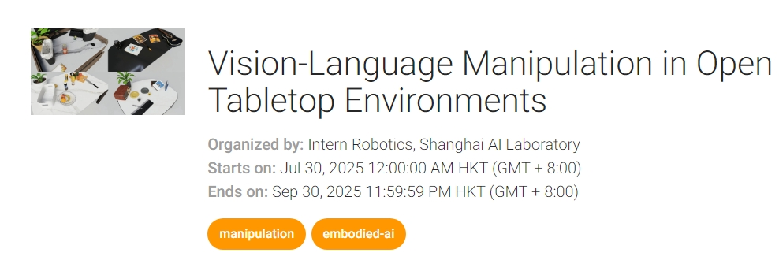

# GenManip: LLM-driven Simulation for Generalizable Instruction-Following Manipulation

<div align="center">

📄 Official Project Page for our **CVPR 2025** paper
🎥 Watch the demo video below to see GenManip in action!

<p align="center"> <a href="https://www.youtube.com/watch?v=FnoFvzVlM6E" target="_blank">  </a> </p>

[-blue)](https://arxiv.org/abs/2506.10966) &nbsp;[](https://genmanip.axi404.top/) &nbsp;[](https://genmanip.axi404.top/overview) &nbsp;

</div>

## 🧠 Overview

**GenManip** is a simulation platform designed for large-scale evaluation of **generalist robotic manipulation policies** under diverse, realistic instruction-following scenarios.

Built on [NVIDIA Isaac Sim](https://developer.nvidia.com/isaac-sim), GenManip offers:

* 🧠 **LLM-driven task generation** via a novel **Task-oriented Scene Graph (ToSG)**
* 🔬 200 curated scenarios for both **modular** and **end-to-end** policy benchmarking
* 🧱 A scalable asset pool with **10,000+ rigid** and **100+ articulated** objects with vision-language labels
* 🧭 Evaluation of **spatial**, **appearance**, **commonsense**, and **long-horizon** reasoning capabilities

## News!!!

We are thrilled to announce the release of **10 hand-crafted post-training tasks** and the synthesis of **over 55K generalizable pick-and-place tasks across \~14K objects on the ALOHA platform** for the **IROS 2025 Challenge: Vision-Language Manipulation in Open Tabletop Environments**.

The pre-training dataset from the GenManip platform features **randomized backgrounds**, **randomized objects**, and **diverse instructions**, enabling strong generalization across a wide range of scenarios.

📌 **Register for the IROS Challenge**: [https://eval.ai/web/challenges/challenge-page/2626/overview](https://eval.ai/web/challenges/challenge-page/2626/overview)



**📂 Data Access**

* **Pre-training Data (Dual-arm Generalizable Pick-and-Place)**: [Hugging Face Link](https://huggingface.co/datasets/InternRobotics/IROS-2025-Challenge-Manip/tree/main)
* **Post-training Data (Dual-arm Manipulation, 10 Tasks)**: [Hugging Face Link](https://huggingface.co/datasets/InternRobotics/IROS-2025-Challenge-Manip/tree/main)

<video src="readme_assets/scaling_data.mp4" controls width="600"></video>

In addition, the **GenManip Benchmark** will soon merge high-quality tasks into [InternManip](https://github.com/InternRobotics/InternManip). We also provide data generated by GenManip through [InternData-M1](https://huggingface.co/datasets/InternRobotics/InternData-M1) — a large-scale embodied robotics dataset containing \~250,000 simulation demonstrations with rich frame-level annotations, including 2D/3D bounding boxes, trajectories, grasp points, and semantic masks.

Due to its massive size, converting from the GenManip format to the LeRobot format has taken some time, and uploads are still in progress. Rest assured, all data has already been generated and will be available soon. Even more **scaling data for long-horizon tasks** is on the way! 🚀


## ✨ Key Features

| Feature                           | Description                                                         |
| --------------------------------- | ------------------------------------------------------------------- |
| 🎯 **ToSG-based Task Synthesis**  | Graph-based semantic representation for generating complex tasks    |
| 🖼️ **Photorealistic Simulation** | RTX ray-traced rendering with physical accuracy                     |
| 📊 **Benchmark Suite**            | 200 high-diversity tasks annotated via human-in-the-loop refinement |
| 🧪 **Evaluation Tools**           | Supports SR, SPL, ablations, and generalization diagnostics         |

## 🛠️ Getting Started

Code is released!

You can visit our [official website](https://genmanip.axi404.top) for more information, documentation, and updates.

## TODO List

### Completed

- GenManip Website for setup, using VLM Agents, and leaderborad
- Code for demogen, render and evaluation

### To Release

- GenManip Bench (20 tasks)
- Full GenManip Bench with evaluation metrics
- GenManip Assets (10K+ objects)
- More models: Seer, ACT, and beyond
- Objaverse scaling pipeline
- etc.

## 📚 Citation

If our work is helpful in your research, please cite:

```bibtex
@inproceedings{gao2025genmanip,
  title={GenManip: LLM-driven Simulation for Generalizable Instruction-Following Manipulation},
  author={Gao, Ning and Chen, Yilun and Yang, Shuai and Chen, Xinyi and Tian, Yang and Li, Hao and Huang, Haifeng and Wang, Hanqing and Wang, Tai and Pang, Jiangmiao},
  booktitle={CVPR},
  year={2025}
}
```

## 📬 Contact & Updates

Have questions or ideas? Reach out via the [project page](https://genmanip.axi404.top) or open an issue.
We welcome contributions, collaborations, and feedback from the community!
